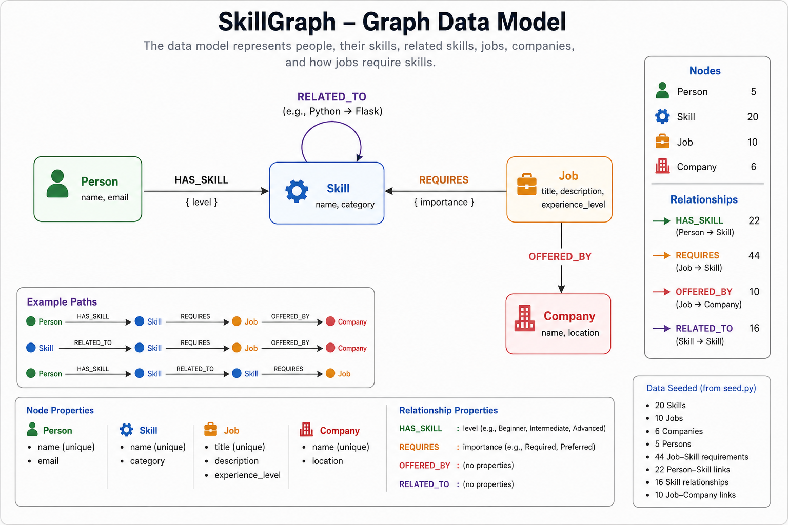
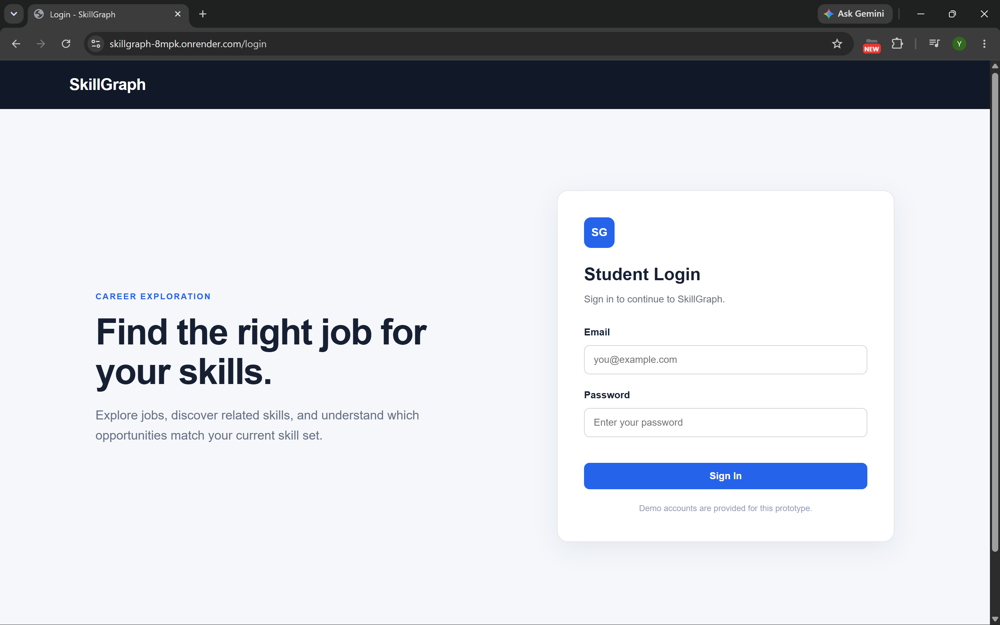
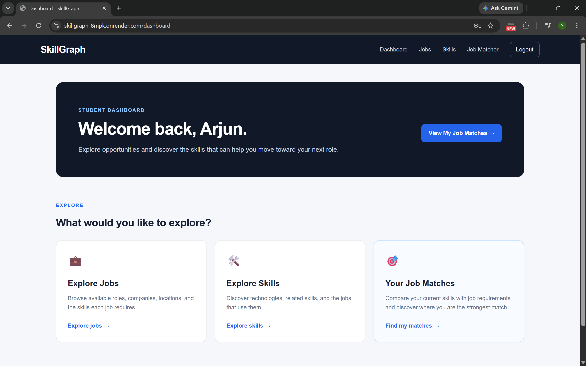
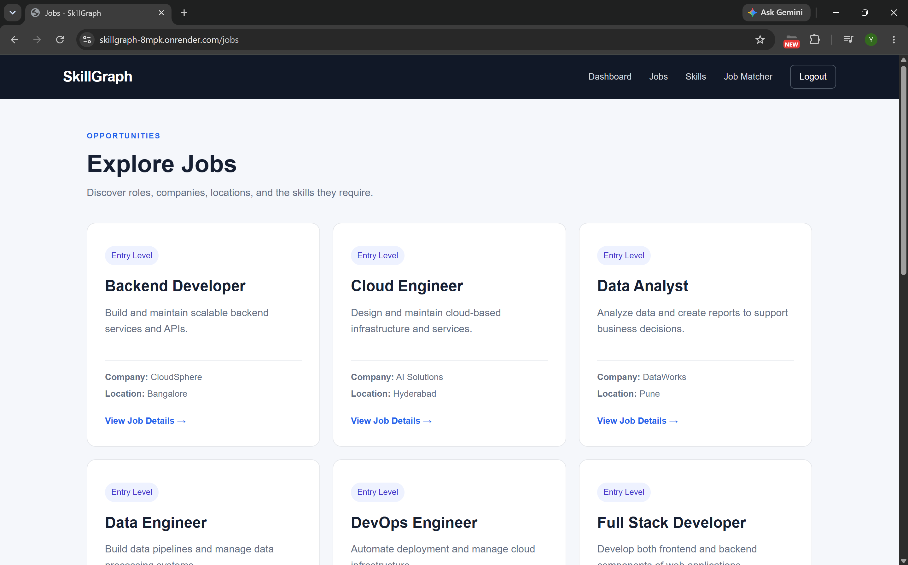
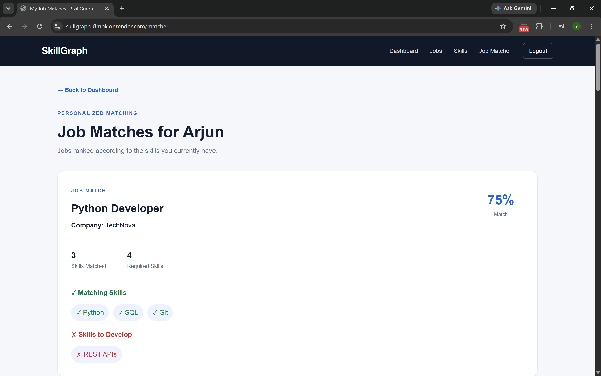

# SkillGraph

SkillGraph is a graph-powered career exploration web application that helps students explore jobs, skills, companies, and personalized job matches.

The application uses CognoDB as the graph database and Flask as the web backend.

---

## Features

- Student login and session-based authentication
- Personalized student dashboard
- Explore available jobs
- View detailed job information
- Explore technical skills
- View related skills and jobs
- Personalized job matching based on student skills
- Matching and missing skill identification
- Graph-based relationship traversal
- Graceful database error handling
- Responsive web interface

---

## Technology Stack

### Backend

- Python
- Flask
- Neo4j Python Driver

### Database

- CognoDB
- Cypher / openCypher

### Frontend

- HTML
- CSS
- Jinja2 Templates

### Configuration

- python-dotenv
- Environment variables

---

## Use Case

SkillGraph is designed to help students understand how their technical skills relate to available career opportunities.

A student can:

1. Log in to the application.
2. Explore available jobs.
3. View the skills required for each job.
4. Explore individual skills and related skills.
5. View personalized job matches based on their existing skills.
6. Identify skills they are missing for particular jobs.

The application models these entities and their relationships as a graph, making it easier to explore connections between students, skills, jobs, and companies.

---

## Why a Graph Database?

SkillGraph focuses on relationships between students, skills, jobs, and companies.

A relational database could store this information using multiple tables and foreign keys, but career exploration often requires traversing several relationships.

For example, SkillGraph can explore paths such as:

`Person → HAS_SKILL → Skill → RELATED_TO → Skill ← REQUIRES ← Job → OFFERED_BY → Company`

This makes graph traversal useful for:

- Finding jobs that match a student's skills
- Identifying missing skills for a job
- Exploring related skills
- Discovering career paths through connected skills and jobs

The graph model keeps these relationships explicit and allows multi-hop queries to be expressed naturally using Cypher.

---

## Graph Data Model



SkillGraph models career-related information using four main node types and four relationship types.

### Nodes

- `Person`
- `Skill`
- `Job`
- `Company`

### Relationships

- `HAS_SKILL` — Person → Skill
- `REQUIRES` — Job → Skill
- `OFFERED_BY` — Job → Company
- `RELATED_TO` — Skill → Skill

### Relationship Properties

`HAS_SKILL` stores the student's skill level:

```text
level
```

Example:

```text
Person ──HAS_SKILL {level: "Intermediate"}──> Skill
```

`REQUIRES` stores the importance of a skill for a job:

```text
importance
```

Example:

```text
Job ──REQUIRES {importance: "Required"}──> Skill
```

---

## Example Graph

```text
Person
   │
   │ HAS_SKILL
   ▼
Skill
   ▲
   │ REQUIRES
   │
Job
   │
   │ OFFERED_BY
   ▼
Company
```

Skills can also be connected:

```text
Skill ──RELATED_TO──> Skill
```

For example:

```text
Python ──RELATED_TO──> Flask
Python ──RELATED_TO──> FastAPI
Python ──RELATED_TO──> Django
```

---

## Main Cypher Queries

The main graph queries are implemented in `queries.py`.

### 1. Authentication

`authenticate_person()` verifies a student's email and password against the `Person` node.

```text
Person
```

The authenticated person's name and email are returned to the Flask application and stored in the session.

---

### 2. Job Exploration

`get_all_jobs()` retrieves jobs together with the companies offering them.

```text
Job ──OFFERED_BY──> Company
```

This query is used by the Explore Jobs page.

---

### 3. Job Details

`get_job_details()` retrieves a selected job, its required skills, and the company offering the job.

```text
Job ──REQUIRES──> Skill
Job ──OFFERED_BY──> Company
```

This is used to display detailed information about a selected job.

---

### 4. Skill Exploration

`get_skill_details()` retrieves a skill, related skills, and jobs that require the skill.

```text
Skill ──RELATED_TO──> Skill
Job ──REQUIRES──> Skill
```

This allows students to explore how skills are connected to different career opportunities.

---

### 5. Personalized Job Matching

`get_jobs_for_person()` compares a person's existing skills with the skills required by each job.

The query identifies:

- Matching skills
- Missing skills
- Number of matching skills
- Total required skills
- Match percentage

The match percentage is calculated using:

```text
matching required skills / total required skills × 100
```

This powers the **Your Job Matches** page.

---

### 6. Multi-hop Career Traversal

`get_related_job_paths()` demonstrates multi-hop graph traversal.

The query explores a path such as:

```text
Person
  ↓ HAS_SKILL
Skill
  ↓ RELATED_TO
Related Skill
  ↑ REQUIRES
Job
  ↓ OFFERED_BY
Company
```

This allows the application to discover jobs connected to a student's existing skills through related skills.

This type of relationship traversal demonstrates where a graph database provides a natural advantage over a traditional relational model.

---

## Job Matching

The Job Matcher compares a student's existing skills with the skills required by each job.

For example:

```text
Student Skills
--------------
Python
SQL
Flask
Git

Job Requirements
----------------
Python
SQL
REST APIs
Flask
Docker
Git
```

The application identifies:

```text
Matching Skills
---------------
Python
SQL
Flask
Git

Missing Skills
--------------
REST APIs
Docker
```

The match percentage is calculated from the number of matching required skills.

This allows students to understand:

- Jobs they currently match
- Skills they need to develop

---

## Application Flow

```text
Open SkillGraph
      ↓
    Login
      ↓
  Dashboard
      │
      ├── Explore Jobs
      │       ↓
      │   Job Details
      │
      ├── Explore Skills
      │       ↓
      │   Skill Details
      │
      └── Your Job Matches
              ↓
        Personalized Matches
```

---

## Project Architecture

```text
Browser
   │
   ▼
Flask Application
   │
   ├── Routes
   │
   └── Jinja Templates
           │
           ▼
       queries.py
           │
           ▼
    Neo4j Python Driver
           │
           ▼
        CognoDB
```

---

## Project Structure

```text
SkillGraph/
│
├── app.py
├── queries.py
├── seed.py
├── requirements.txt
├── .gitignore
├── README.md
│
├── templates/
│   ├── base.html
│   ├── login.html
│   ├── dashboard.html
│   ├── jobs.html
│   ├── job_details.html
│   ├── skills.html
│   ├── skill_details.html
│   ├── matches.html
│   ├── error.html
│   └── 404.html
│
└── static/
    ├── css/
    │   └── style.css
    │
    └── images/
        └── skillgraph_data_model.png
```

---

## Setup

### 1. Create a CognoDB Instance

1. Create a CognoDB account.
2. Create a free C0 instance from the CognoDB Cloud console.
3. Select a region.
4. Copy the generated connection URI and password.
5. The generated database username is `cognodb`.
6. Store the connection details in environment variables.

The connection URI has the following form:

```text
bolt+s://<instance-id>.databases.cognodb.cloud
```

The application connects to CognoDB using the official Neo4j Python driver.

---

### 2. Clone the Repository

```bash
git clone <YOUR_GITHUB_REPOSITORY_URL>
cd SkillGraph
```

---

### 3. Create a Virtual Environment

```bash
python -m venv venv
```

Activate it on Windows:

```bash
venv\Scripts\activate
```

---

### 4. Install Dependencies

```bash
pip install -r requirements.txt
```

---

### 5. Configure Environment Variables

Create a `.env` file in the project root:

```text
COGNODB_URI=your_cognodb_uri
COGNODB_USERNAME=cognodb
COGNODB_PASSWORD=your_cognodb_password
FLASK_SECRET_KEY=your_secret_key
```

Do not commit `.env` to GitHub.

---

### 6. Seed the Database

Run:

```bash
python seed.py
```

The seed script creates:

- Skills
- Companies
- Jobs
- Job-skill relationships
- Job-company relationships
- Skill relationships
- Persons
- Person-skill relationships

You should see confirmation messages in the terminal after successful seeding.

---

### 7. Run the Application

For local development:

```bash
python app.py
```

Open:

```text
http://127.0.0.1:5000
```

---

## Demo Accounts

The project contains demo student accounts for testing.

| Student | Email | Password |
|---|---|---|
| Arjun | arjun@example.com | arjun123 |
| Priya | priya@example.com | priya123 |
| Rahul | rahul@example.com | rahul123 |
| Ananya | ananya@example.com | ananya123 |
| Vikram | vikram@example.com | vikram123 |

These accounts are for demonstration purposes only.

---

## Sample Graph Data

The seeded dataset contains:

- 5 Persons
- 20 Skills
- 10 Jobs
- 6 Companies
- 22 Person–Skill relationships
- 44 Job–Skill requirements
- 16 Skill relationships
- 10 Job–Company relationships

---

## Authentication

SkillGraph uses Flask sessions to maintain the currently logged-in student.

After successful authentication:

```text
Login
  ↓
Session created
  ↓
Dashboard
  ↓
Personalized Job Matches
```

Protected pages redirect unauthenticated users back to the login page.

Logging out clears the current session.

---

## Error Handling

The application includes error handling for:

- Database connectivity issues
- Invalid job requests
- Invalid skill requests
- Unauthorized access
- Missing pages

A dedicated health endpoint is available at:

```text
/health
```

It verifies whether the application can connect to CognoDB.

Database connection failures are handled gracefully instead of exposing raw database errors to the user.

---

## Screenshots

### Login



### Dashboard



### Job Details



### Personalized Job Matches



---

## Hosted Demo

Live application:

```text
https://skillgraph-8mpk.onrender.com/
```

The application is deployed using Render and connects to the CognoDB database using environment variables.

---

## Graph Traversal Example

One of the graph queries explores relationships between a student's existing skills, related skills, and jobs.

Example path:

```text
Person
   ↓ HAS_SKILL
Existing Skill
   ↓ RELATED_TO
Related Skill
   ↑ REQUIRES
Job
   ↓ OFFERED_BY
Company
```

For example:

```text
Arjun
  ↓
Python
  ↓
Flask
  ↑
Backend Developer
  ↓
CloudSphere
```

This demonstrates how SkillGraph uses graph relationships to discover career-related connections.

---

## Security Notes

Database connection details are stored using environment variables and are not committed to the repository.

The `.env` file is excluded from version control using `.gitignore`.

The demo login accounts are intended only for this prototype and should not be considered production authentication.

---

## Future Improvements

Possible future improvements include:

- Password hashing
- User registration
- Admin dashboard
- More jobs and companies
- Job search and filtering
- Skill recommendations
- Learning-resource recommendations
- Advanced graph-based career paths
- Production authentication and authorization

---

## Author

Developed as a graph database application project using:

- Python
- Flask
- CognoDB
- Cypher
- Neo4j Python Driver
- HTML
- CSS
- Jinja2